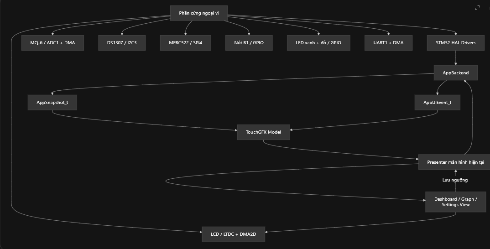
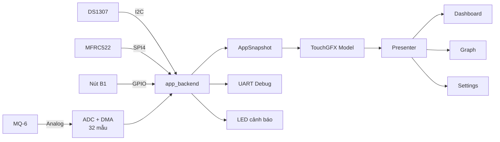
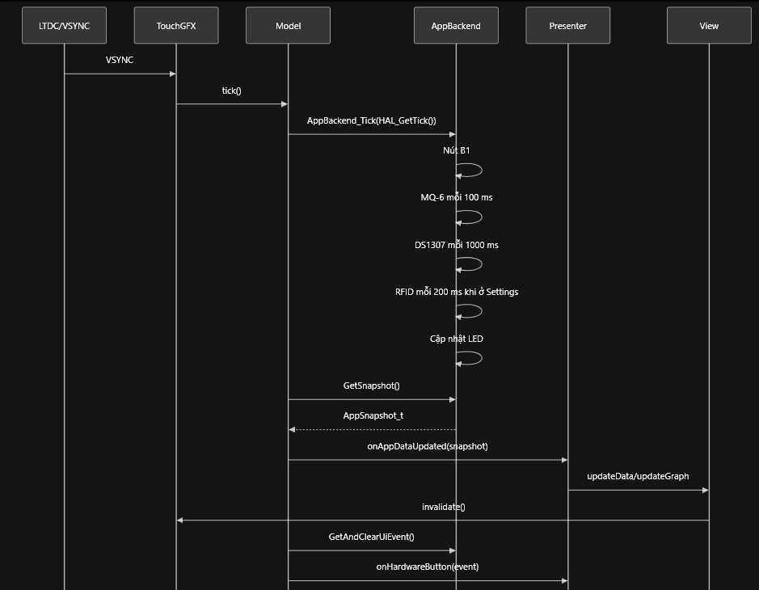
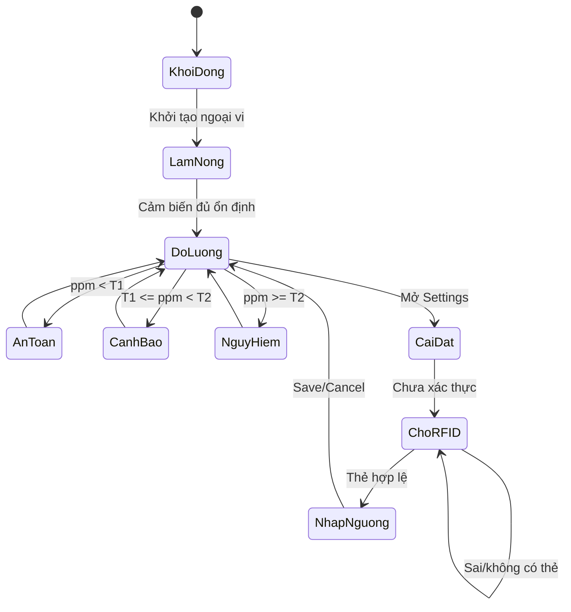
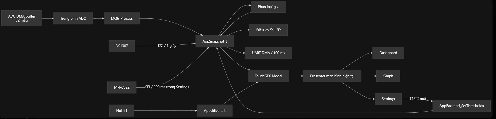

# Hệ thống giám sát rò rỉ khí gas dùng STM32F429 và TouchGFX

## 1. Giới thiệu

Project xây dựng một hệ thống nhúng giám sát khí gas theo thời gian thực, sử dụng:

- **STM32F429ZIT6** làm bộ xử lý trung tâm.
- **MQ-6** để thu tín hiệu tương ứng với LPG.
- **DS1307** để cung cấp thời gian thực.
- **MFRC522 (RC522)** để xác thực trước khi thay đổi ngưỡng cảnh báo.
- **TouchGFX** để hiển thị Dashboard, đồ thị và màn hình Settings.
- **UART, nút B1 và LED có sẵn trên kit** để debug, điều hướng và cảnh báo.

Hệ thống đọc ADC bằng DMA, lọc trung bình nhiều mẫu, quy đổi điện áp và giá trị ppm ước lượng, phân loại theo ba mức cảnh báo, hiển thị dữ liệu lên màn hình và gửi bản tin giám sát qua UART.


## 2. Chức năng chính

- Đọc tín hiệu analog từ MQ-6 bằng ADC + DMA.
- Trung bình hóa **32 mẫu ADC** để giảm nhiễu tức thời.
- Hiển thị:
  - ADC raw.
  - Điện áp ADC.
  - Điện áp MQ-6 sau quy đổi.
  - Nồng độ gas ước lượng theo ppm.
  - Thời gian từ DS1307.
  - Trạng thái an toàn/cảnh báo/nguy hiểm.
- Vẽ đồ thị nồng độ gas theo thời gian.
- Cho phép cấu hình hai ngưỡng `T1`, `T2`.
- Chỉ mở chức năng chỉnh ngưỡng sau khi xác thực thẻ RFID.
- Điều hướng bằng nút B1.
- Gửi dữ liệu định kỳ qua UART để kiểm tra bằng Hercules/Serial Terminal.

Ngưỡng mặc định của project:

| Mức | Điều kiện | Ý nghĩa |
|---|---:|---|
| An toàn | `ppm < T1` | Giá trị dưới ngưỡng cảnh báo |
| Cảnh báo | `T1 <= ppm < T2` | Cần kiểm tra nguồn rò rỉ |
| Nguy hiểm | `ppm >= T2` | Kích hoạt cảnh báo mức cao |
| Mặc định | `T1 = 1000`, `T2 = 2000` ppm | Chỉ là giá trị demo, cần hiệu chuẩn trước khi sử dụng thực tế |

---
Quy trình : 
MQ-6 (AO) → Cầu chia áp (Rtop/Rbottom) → ADCraw → VADC = ADCraw × VREF / 4095 → VAO = VADC × (Rtop + Rbottom) / Rbottom
→ Rs = RL × (VC − VAO) / VAO → Ratio = Rs / R0 → PPM = 10^((log10(Ratio) − B) / M) → So sánh với T1 và T2
→ Hiển thị An toàn / Cảnh báo / Nguy hiểm

## 3. Kiến trúc hệ thống



TouchGFX sử dụng mô hình **Model–View–Presenter**. Phần đọc phần cứng nằm ở backend; UI chỉ nhận một bản sao dữ liệu `AppSnapshot_t`. Cách tách này giúp việc render màn hình không trực tiếp chặn quá trình đo.

---

## 4. Phần cứng và giao tiếp

| Khối | Giao tiếp | Vai trò |
|---|---|---|
| MQ-6 module | ADC | Cung cấp điện áp tỷ lệ với trạng thái khí gas |
| DS1307 module | I2C | Ngày giờ và timestamp |
| RC522 | SPI4 + CS/RST GPIO | Xác thực quyền sửa ngưỡng |
| LCD/TouchGFX | LTDC | Hiển thị giao diện |
| UART trên kit | USART | Log dữ liệu và debug |
| B1, LED trên kit | GPIO | Điều hướng/cảnh báo |

Các chân cụ thể phải đối chiếu với file `.ioc` đang dùng. Không tự đổi chân trong tài liệu mà chưa kiểm tra lại CubeMX và sơ đồ kit.

> **[CHÈN ẢNH THỰC TẾ 01 – Toàn bộ mạch đã lắp]**  
> Gợi ý tên ảnh: `docs/images/hardware-overview.jpg`

> **[CHÈN ẢNH THỰC TẾ 02 – Màn hình Dashboard đang chạy]**  
> Gợi ý tên ảnh: `docs/images/dashboard-running.jpg`

---

## 5. Luồng hoạt động




Điều kiện lưu ngưỡng:

```text
0 <= T1 < T2 <= 9999
```

Trong lúc người dùng mở Settings hoặc quét RFID, backend vẫn phải tiếp tục lấy mẫu và đánh giá cảnh báo.

---

## 6. Build và chạy

1. Mở file `.ioc` bằng STM32CubeMX/STM32CubeIDE.
2. Kiểm tra ADC + DMA, I2C, SPI4, UART, LTDC/TouchGFX và các GPIO.
3. Generate Code.
4. Mở TouchGFX Designer, Generate Code sau khi chỉnh giao diện.
5. Build project trong STM32CubeIDE.
6. Nạp chương trình bằng ST-LINK.
7. Mở cổng COM đúng baud rate, data bits, parity và stop bits đã cấu hình trong CubeMX.
8. Quan sát Dashboard, đồ thị, RTC, RFID và dữ liệu UART.

Luồng dữ liệu : 


---

## 7. Timing và dải đo trong thực tế

### 7.1. Timing không chỉ là tốc độ CPU

Độ trễ cảnh báo tổng thể có thể biểu diễn gần đúng:

```text
T_alarm =
T_khi_di_chuyen_den_cam_bien
+ T_dap_ung_MQ6
+ T_cua_so_loc
+ T_xu_ly
+ T_cap_nhat_canh_bao
```

STM32 có thể đọc ADC rất nhanh, nhưng **động học của cảm biến và quá trình khí khuếch tán thường chậm hơn nhiều**. Vì vậy, tăng tốc vòng lặp không làm cảm biến phản ứng tức thì.

Các mục tiêu timing đề xuất cho prototype:

| Tác vụ | Chu kỳ/mục tiêu đề xuất | Ghi chú |
|---|---:|---|
| ADC + DMA | Liên tục | Không dùng polling chặn |
| Tính trung bình/ppm | 100–250 ms | Không cần tính lại ở mỗi frame |
| Đánh giá cảnh báo | Ngay sau snapshot mới | Tách khỏi render UI |
| Cập nhật Dashboard | 100–250 ms | Tránh invalidate toàn màn hình |
| Thêm điểm đồ thị | 500–1000 ms | Giảm tải render |
| Đọc RTC | 1000 ms | Thời gian hiển thị không cần nhanh hơn |
| Gửi UART | 500–1000 ms | Dùng timeout ngắn hoặc DMA/IT |
| Quét RFID | 100–300 ms | Không được làm dừng đo gas |

Đây là **ngân sách thiết kế giả định**, không phải yêu cầu của một tiêu chuẩn an toàn.

### 7.2. Tình huống thực tế ảnh hưởng kết quả

| Tình huống | Ảnh hưởng function | Ảnh hưởng timing/độ chính xác | Biện pháp |
|---|---|---|---|
| Quạt, gió hoặc đặt cảm biến xa nguồn rò | Vẫn đo được nhưng giá trị thấp/chậm | Tăng thời gian khí đến cảm biến | Quy định vị trí lắp và kiểm thử bằng nhiều vị trí |
| Nhiệt độ/độ ẩm thay đổi | Giá trị ppm có thể lệch | Drift theo môi trường | Hiệu chuẩn theo điều kiện sử dụng; ghi nhận nhiệt độ/độ ẩm nếu cần |
| Vừa cấp nguồn | Có số đọc nhưng chưa ổn định | Dễ báo sai | Tách “khởi động UI” và “cảm biến sẵn sàng” |
| Nồng độ cao kéo dài | Có thể bão hòa | Thời gian hồi phục dài | Gắn cờ quá dải, không hiển thị số ppm giả chính xác |
| Nguồn 5 V/heater không ổn định | Tín hiệu dao động | Tăng sai số và trễ ổn định | Nguồn riêng đủ dòng, tụ decoupling, nối mass đúng |
| UART blocking hoặc `HAL_Delay()` dài | UI/đo có thể đứng | Tăng jitter, bỏ lỡ deadline | Lập lịch theo tick; DMA/interrupt; tránh delay trong vòng lặp chính |
| Render TouchGFX nặng | Màn hình nháy/chậm | Không được phép làm chậm cảnh báo | Chỉ invalidate widget thay đổi; cảnh báo xử lý ở backend |
| Lỗi RTC | Sai timestamp | Không nên làm mất cảnh báo gas | Dùng cờ `rtc_valid`; cảnh báo độc lập RTC |
| RFID lỗi/chưa quét | Không sửa được ngưỡng | Không ảnh hưởng đo | Giữ logic đo hoạt động độc lập Settings |

Ví dụ so sánh:
- Với hệ thống gas này, yêu cầu tương đương là: **không chỉ tính được ppm**, mà còn phải biết bao lâu sau khi khí xuất hiện hệ thống mới cảnh báo, giá trị có nằm trong dải cảm biến hay không, và sai số có thể đến từ đâu.

### 7.3. Dải đo

Theo tài liệu nhà sản xuất, MQ-6 có dải phát hiện điển hình **300–10000 ppm đối với CH4/C3H8**. Vì vậy:

- Dưới 300 ppm: không nên khẳng định độ chính xác định lượng.
- Trong 300–10000 ppm: chỉ có ý nghĩa sau khi hiệu chuẩn `R0`, đặc tuyến và phần cứng thực tế.
- Trên 10000 ppm: hiển thị `OVER RANGE` thay vì tiếp tục ngoại suy.
- Các ngưỡng 1000/2000 ppm trong project chỉ dùng minh họa thuật toán ba mức.

MQ-6 yêu cầu thời gian tiền nung ban đầu dài; tài liệu Winsen nêu **không dưới 48 giờ** trong điều kiện thử chuẩn. Warm-up vài chục giây chỉ phù hợp cho demo giao diện, không chứng minh cảm biến đã ổn định.

---

## 8. Kiểm thử tối thiểu

- ADC raw thay đổi khi điện áp AO thay đổi.
- Không vượt quá điện áp đầu vào ADC của STM32.
- UART đúng baud rate và không còn ký tự rác.
- RTC tiếp tục chạy khi reset MCU.
- RFID đúng/sai thẻ được phân biệt.
- `T1 < T2`, không lưu giá trị ngoài 0–9999.
- Mở Graph/Settings không làm dừng đo.
- Khi giả lập nồng độ qua ngưỡng, LED và giao diện đổi trạng thái đúng.
- Đo thời gian từ khi tín hiệu ADC vượt ngưỡng đến khi LED đổi trạng thái.
- Ghi log min/mean/max chu kỳ backend để phát hiện jitter.

> **[ẢNH Log UART khi chạy ổn định]**

> **[ẢNH Màn hình Graph và ba vùng cảnh báo]**

---


## 10. Tài liệu tham khảo

1. STMicroelectronics, **STM32F429/439 Documentation**  
   https://www.st.com/en/microcontrollers-microprocessors/stm32f429-439/documentation.html


---

## 11. Authors

- `[Hoàng Văn Thi – 20239753]`
- `[Cao Tiến Dũng – 20239754]`
- `[Nguyễn Vũ Duy Anh – 20239755]`
- `[Cao Tiến Dũng – 20239754]`
- `[GVHD - Ths Nguyễn Đức Tiến]`
- `[Hoàng Văn Thi – 20239753 - Tìm hiểu đề tài triển khai kiến trúc]`
- `[Cao Tiến Dũng – 20239754 - Lắp mạch phần cứng ]`
- `[Nguyễn Vũ Duy Anh – 20239755 - Triển khai phần đọc dữ liệu với ADC và DMA]`
- `[Lê Thanh Hưng – 20235341 - Thiết kế giao diện]`
